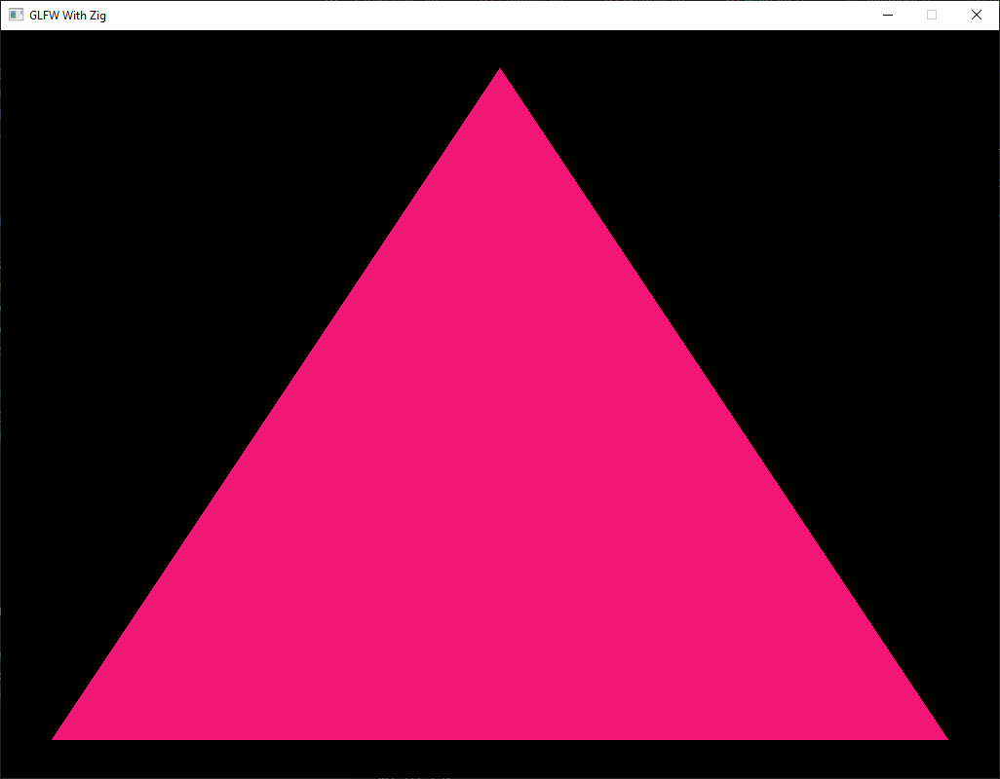

# Using GLFW with Zig on Windows
The purpose of this project is to give an example on how to compile the GLFW and Glad libraries on Windows using build.zig for Zig.
The current Zig version this project used is 0.13.0.

The `build.zig` file compiles glfw and glad into a static library, and compiles/copies the Translate C Zig files of the glfw and glad headers onto the `src/compiled/` directory.

## Dependencies
* [glfw](https://github.com/glfw/glfw) source code version 3.4 was used (https://github.com/glfw/glfw/releases/tag/3.4)
* [glad](https://github.com/Dav1dde/glad) was used to build and compile the function pointers for OpenGL. If you want to refine/limit the function pointers, the websites used to compile glad are https://github.com/Dav1dde/glad and https://glad.dav1d.de
